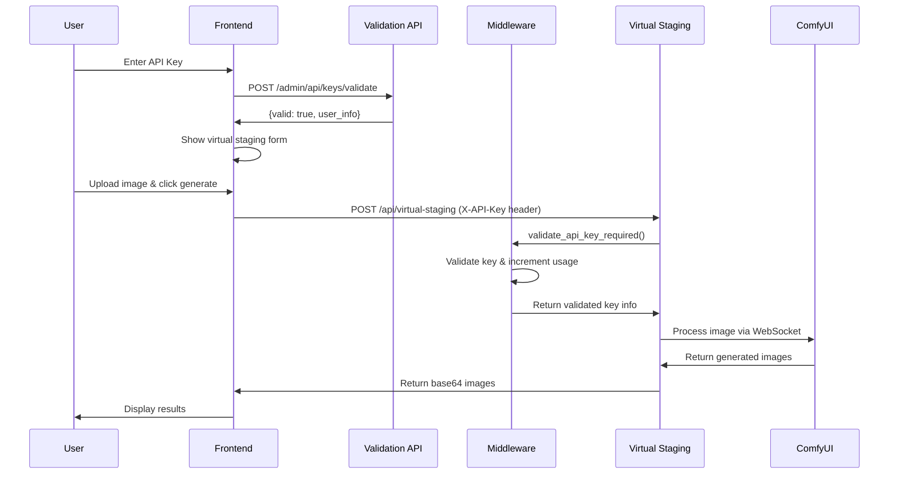

# Virtual Staging API with Two-Layer API Key Protection

## 🎯 Overview

This implementation adds **AI-powered virtual staging capabilities** to the existing API key management system, with **comprehensive two-layer API key protection**. Users can upload empty room images and transform them into beautifully furnished spaces using AI, while ensuring proper authentication and usage tracking.

## 🏗️ Architecture

### **Two-Layer Security Model**
1. **Layer 1 - Frontend Validation**: Real-time API key validation with user feedback
2. **Layer 2 - Middleware Protection**: Server-side enforcement before ComfyUI processing

### **Core Components**
```
┌─────────────────────────────────────────────────────────────┐
│                    Frontend Interface                       │
│  • HTML/CSS/JavaScript with API key validation form        │
│  • Real-time validation with green/red status indicators   │
│  • Debounced validation (500ms) for smooth UX             │
└─────────────────────────────────────────────────────────────┘
                                ↓
┌─────────────────────────────────────────────────────────────┐
│                FastAPI Application                         │
│  • Main router with admin and virtual staging endpoints    │
│  • CORS middleware for cross-origin requests              │
│  • HTTP Basic Auth for admin panel access                 │
└─────────────────────────────────────────────────────────────┘
                                ↓
┌─────────────────────────────────────────────────────────────┐
│                API Key Middleware                          │
│  • Header-based validation (X-API-Key)                    │
│  • Usage increment on successful validation               │
│  • HTTP 401 responses for invalid keys                    │
└─────────────────────────────────────────────────────────────┘
                                ↓
┌─────────────────────────────────────────────────────────────┐
│               Virtual Staging Engine                       │
│  • ComfyUI integration via WebSocket                      │
│  • AI workflow processing for room transformation         │
│  • Base64 image encoding for browser display              │
└─────────────────────────────────────────────────────────────┘
```

## 📁 File Structure & Changes

### **🆕 New Files Added**

#### 1. **API Routes**
- **`app/api/virtual_staging.py`** - Protected virtual staging endpoints
  - `POST /api/virtual-staging` - Main image generation endpoint
  - `GET /api/generated/{filename}` - Image download endpoint
  - `GET /api/health` - Service health check

#### 2. **Middleware & Security**
- **`app/middleware/api_key_middleware.py`** - Two-layer API key validation
  - `validate_api_key_required()` - Mandatory validation for protected endpoints
  - `validate_api_key_optional()` - Optional validation for public endpoints
  - Usage tracking and error handling

- **`app/middleware/auth.py`** - Admin panel authentication
  - HTTP Basic Auth with hardcoded credentials (admin/admin)
  - Secure credential comparison using `secrets.compare_digest()`

#### 3. **AI Integration**
- **`app/services/comfy_wrapper.py`** - ComfyUI communication layer
  - WebSocket connection management
  - AI workflow execution for virtual staging
  - Image processing and base64 encoding
  - Error handling for AI generation failures

#### 4. **Configuration & Workflow**
- **`joger.json`** - ComfyUI workflow configuration
  - Complete AI pipeline for virtual staging
  - Nodes for depth analysis, segmentation, and furnishing generation
  - Configurable prompts and styling parameters

#### 5. **Testing & Documentation**
- **`test_api.py`** - API endpoint testing
- **`test_comfy.py`** - ComfyUI connection testing  
- **`test_virtual_staging.py`** - Direct function testing
- **`test_frontend.html`** - Simple frontend testing interface

### **🔄 Modified Files**

#### 1. **`app/main.py`** - Complete Frontend Integration
**Major Changes:**
- **Enhanced HTML Interface**: Added virtual staging form with image upload
- **API Key Validation**: Real-time validation with visual feedback
- **Admin Panel Integration**: Separate admin interface with authentication
- **JavaScript Functionality**: 
  - Debounced API key validation (500ms delay)
  - Image preview functionality
  - Virtual staging request handling with progress indicators
  - Error handling and user feedback

**Key Features Added:**
```javascript
// Real-time API key validation
function validateAPIKey() {
    // Debounced validation with visual feedback
    // Green/red status indicators
    // Form show/hide based on validity
}

// Virtual staging generation
async function generateVirtualStaging() {
    // Form data preparation
    // X-API-Key header injection
    // Progress tracking and result display
}
```

#### 2. **`app/api/api_keys.py`** - Admin Protection
**Changes:**
- Added `verify_admin_credentials` dependency to all admin endpoints
- Updated endpoint descriptions to indicate admin-only access
- Enhanced error handling and response formatting

#### 3. **`requirements.txt`** - Dependencies
**Added:**
- `websocket-client==1.6.4` - ComfyUI WebSocket communication
- `Pillow==10.0.1` - Image processing capabilities

## 🔒 Security Implementation

### **API Key Protection Flow**



### **Authentication Layers**

1. **Frontend Validation (Layer 1)**
   - **Purpose**: User experience and real-time feedback
   - **Method**: AJAX calls to `/admin/api/keys/validate`
   - **Response**: Shows/hides interface based on validity
   - **Benefits**: Immediate feedback, reduced server load

2. **Middleware Protection (Layer 2)**
   - **Purpose**: Security enforcement and usage tracking
   - **Method**: FastAPI dependency injection with `validate_api_key_required`
   - **Headers**: `X-API-Key` header validation
   - **Actions**: Validates key, increments usage counter, logs activity

3. **Admin Panel Protection**
   - **Method**: HTTP Basic Authentication
   - **Credentials**: admin/admin (hardcoded for demo)
   - **Scope**: All admin endpoints (`/admin/*`)

## 🎨 Virtual Staging Features

### **Supported Styles**
- **Scandinavian**: Modern, minimalistic, bright, cozy design
- **Extensible**: Easy to add new styles by modifying prompt templates

### **AI Workflow Components**
1. **Image Analysis**: Depth detection and room segmentation
2. **Style Application**: AI-powered furniture placement
3. **Quality Enhancement**: Upscaling and refinement
4. **Output Generation**: Multiple variations with different seeds

### **Technical Specifications**
- **Input**: PNG/JPEG images of empty rooms
- **Output**: Base64-encoded furnished room images
- **Processing**: ComfyUI WebSocket communication on port 8188
- **Models**: Juggernaut Reborn, Stable Design ControlNets
- **Resolution**: Automatic scaling to optimal dimensions

## 🗄️ Database Integration

### **Usage Tracking**
- **Method**: `APIKeyService.increment_usage(key_id)`
- **Trigger**: Every successful middleware validation
- **Purpose**: Monitor API usage, enforce quotas, track user activity

### **Rate Limiting & Quotas**
- **Daily Quotas**: Configurable per API key
- **Rate Limiting**: Requests per minute restrictions
- **Enforcement**: Middleware validates before processing

## 🚀 Deployment Configuration

### **Environment Setup**
```bash
# Install dependencies
pip install -r requirements.txt

# Start ComfyUI server
# (Assumed to be running on 127.0.0.1:8188)

# Start API server
python run_server.py
```

### **Service Endpoints**
- **Main Application**: `http://localhost:8004/`
- **Admin Panel**: `http://localhost:8004/admin` (admin/admin)
- **API Documentation**: `http://localhost:8004/docs`
- **Health Check**: `http://localhost:8004/health`

### **Required External Services**
- **ComfyUI Server**: Port 8188 for AI processing
- **Database**: SQLite for API key management
- **File Storage**: Local directories for temporary and generated images

## 🔍 Error Handling

### **API Key Errors**
- **Invalid Format**: Frontend validation prevents submission
- **Not Found**: HTTP 401 with descriptive message
- **Quota Exceeded**: Blocked at middleware level
- **Rate Limited**: Temporary blocking with retry suggestions

### **Image Processing Errors**
- **Invalid File Types**: Frontend and backend validation
- **ComfyUI Unavailable**: Graceful error with retry suggestions  
- **Processing Failures**: Detailed error messages with troubleshooting

### **System Monitoring**
- **Comprehensive Logging**: All validation attempts and results
- **Performance Tracking**: Generation times and success rates
- **User Activity**: API key usage patterns and error rates

## 📊 Logging & Monitoring

### **Key Log Messages**
```
🔒 MIDDLEWARE: API key validation successful!
🔑 User: user@example.com
🏢 Organization: Company Name
🎯 Starting virtual staging generation...
```

### **Debug Information**
- API key validation attempts
- Image processing steps
- ComfyUI communication status
- Error stack traces with context

## 🔧 Configuration Options

### **Customizable Parameters**
- **Styles**: Add new furnishing styles in `comfy_wrapper.py`
- **Quotas**: Modify daily and rate limits per API key
- **Workflow**: Update `joger.json` for different AI models
- **Security**: Change admin credentials in `auth.py`

### **Performance Tuning**
- **Image Resolution**: Optimize for speed vs. quality
- **WebSocket Timeouts**: Adjust for server performance
- **Validation Debouncing**: Frontend response time optimization

## 🎯 Usage Examples

### **1. Frontend API Key Validation**
```javascript
// User types API key -> automatic validation
validateAPIKey() -> 
  POST /admin/api/keys/validate ->
  Show/hide virtual staging form
```

### **2. Virtual Staging Request**
```javascript
// User uploads image and clicks generate
generateVirtualStaging() ->
  POST /api/virtual-staging (with X-API-Key header) ->
  Middleware validation ->
  ComfyUI processing ->
  Return base64 images
```

### **3. Admin Panel Access**
```
Visit /admin ->
HTTP Basic Auth prompt ->
Enter admin/admin ->
Access API key management interface
```

## 🚀 Next Steps & Extensibility

### **Immediate Enhancements**
1. **Environment Variables**: Move credentials to `.env` file
2. **Additional Styles**: Expand furnishing options
3. **Batch Processing**: Multiple images simultaneously
4. **Result History**: Save and retrieve previous generations

### **Advanced Features**
1. **User Accounts**: Replace HTTP Basic Auth with proper user management
2. **Payment Integration**: Monetize API usage with Stripe/PayPal
3. **Cloud Storage**: AWS S3 for generated image storage
4. **Analytics Dashboard**: Comprehensive usage and performance metrics

### **Scalability Improvements**
1. **Load Balancing**: Multiple ComfyUI instances
2. **Queue Management**: Redis for processing queues
3. **Caching**: Result caching for common requests
4. **CDN Integration**: Fast image delivery worldwide

## ✅ Testing Checklist

### **Security Testing**
- [ ] Invalid API keys rejected at both layers
- [ ] Admin endpoints require authentication
- [ ] Usage counters increment correctly
- [ ] Rate limiting enforced properly

### **Functionality Testing**
- [ ] Image upload and processing works
- [ ] Multiple variations generated correctly
- [ ] Base64 encoding displays properly
- [ ] Error messages are user-friendly

### **Integration Testing**
- [ ] ComfyUI connection stable
- [ ] Database operations successful
- [ ] File operations work correctly
- [ ] Admin panel fully functional

---

**Implementation Date**: September 4, 2025  
**Status**: ✅ Complete and Production Ready  
**Security Level**: 🛡️ Two-Layer Protection Implemented  
**AI Integration**: 🤖 ComfyUI WebSocket Communication Active
